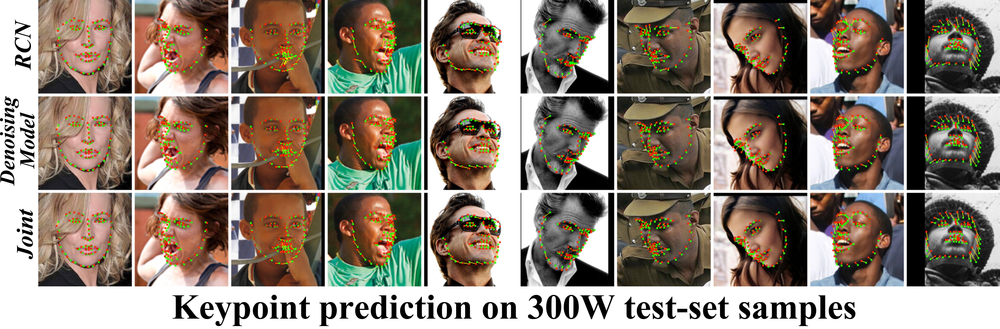

# RCN
The code for the [Recombinator Networks](http://arxiv.org/abs/1511.07356) paper.

<p align="center">
  
</p>
-----------------------------
<p align="center">
  
</p>
-----------------------------
<p align="center">
  
</p>

------------------------------------

# Citation

If you use this code please consider citing our paper:

* Sina Honari, Jason Yosinski, Pascal Vincent, Christopher Pal. [Recombinator Networks: Learning Coarse-to-Fine Feature Aggregation](http://arxiv.org/pdf/1511.07356v2), in IEEE Conference on Computer Vision and Pattern Recognition (CVPR), 2016.

Bibtex:

    @inproceedings{nguyen2015deep,
    title={Recombinator Networks: Learning Coarse-to-Fine Feature Aggregation},
    author={Honari, Sina and Yosinski, Jason and Vincent, Pascal and Pal, Christopher},
    booktitle={Computer Vision and Pattern Recognition (CVPR), 2016 IEEE Conference on},
    year={2016},
    organization={IEEE}
    }

------------------------------------
# Setting up and traning the models
## Step 1: Installation

1. Install theano by following the instruction given here:
http://deeplearning.net/software/theano/install.html

2. Clone RCN repo

3. In ~/.bashrc add the parent directory of the clonded RCN repo to PYTHONPATH: <br />
`export PYTHONPATH=/path/to/parent/dir/of/RCN:$PYTHONPATH`

------------------------------------

## Step 2: Dataset Creation

There are two datasets: 5-keypoint (MTFL) and 68-keypoint (300W) datasets

### 2.1 - MTFL Dataset:
Run `create_raw_afw.py` and `create_raw_MTFL.py` modules in preprocessing directory. <br />
`create_raw_MTFL.py` creates the train set and the AFLW test set. <br />
`create_raw_afw.py` creates the AFW test set. <br />
Here is how to run these modules:

#### Train and AFLW dataset creation:
1. Download the images from:
http://mmlab.ie.cuhk.edu.hk/projects/TCDCN/data/MTFL.zip

2. Unzip the folder and pass the complete path to it to `--src_dir` when calling `create_raw_MTFL.py` module.

3. Call `create_raw_MTFL.py` by passing complete path to `--src_dir` and `--dest_dir` arguments: <br />
```
python create_raw_MTFL.py  --src_dir=/complete/path/to/MTFL/unzipped/folder --dest_dir=/complete/path/to/RCN/datasets
```

Note: dest_dir is the location where the dataset will be created. It should be finally put in RCN/datasets directory
of the repo when training the models.

This module will create MTFL_test_160by160.pickle and MTFL_train_160by160.pickle in the given dest_dir path.

#### AFW dataset creation:

1. Download the images from:
https://www.ics.uci.edu/~xzhu/face/AFW.zip

2. Unzip the folder and pass the complete path to it to `--src_dir` when calling `create_raw_MTFL.py` module.

3. Call `create_raw_MTFL.py` module by passing complete path to `--src_dir` and `--dest_dir` arguments: <br />
```
python create_raw_afw.py  --src_dir=/complete/path/to/AFW/unzipped/folder --dest_dir=/complete/path/to/RCN/datasets
```

This module will create AFW_test_160by160.pickle in the given dest_dir path.

### 2.2 - 300W dataset:
Run create_raw_300W.py module in preprocessing directory as follows:

1. Download Helen, LFPW, AFW and IBUG datasets from:
http://ibug.doc.ic.ac.uk/resources/facial-point-annotations/

2. Once unzipped, the helen and lfpw have two subdirectories, 'testset' and 'trainset'.
Rename them to 'X_testset' and 'X_trainset', for each dataset X.

3. Create one directory named 'Train_set' and put unzipped 'afw', 'helen_trainset'
and 'lfpw_trainset' directories into it (as three sub-directories).

4. Create another directory named 'Test_set' and put unzipped 'ibug', 'helen_testset' and 'lfpw_testset'
into it (as three sub-directories).

5. Put 'Train_set' and 'Test_set' directories into one direcotory (i.e. 300W) and pass
the complete path to it to `--src_dir` when calling this module.

6. Call `create_raw_300W.py` module by passing complete path to `--src_dir` and `--dest_dir` arguments: <br />
```
python create_raw_300W.py --src_dir=/complete/path/to/300W/folder --dest_dir=/complete/path/to/RCN/datasets
```

This module will create 300W_test_160by160.pickle and 300W_train_160by160.pickle files in the given dest_dir path.

------------------------------------

## Step 3: Model Training
`create_procs.py` module in RCN/models should be called with the right arguments to train each model. <br />
The Theano flag `THEANO_FLAGS=floatX=float32,device=gpu,force_device=True` should be used right before the python command
to train the model on gpu and set the type of shared varibles to float32: <br />
```
THEANO_FLAGS=floatX=float32,device=gpu,force_device=True python create_procs.py <'flags'>
```

Here is the set of flags to be used for training each model:

### Training SumNet for MTFL:
```
python create_procs.py --L2_coef=1e-10 --L2_coef_ful=1e-14 --L2_coef_out=1e-14 --file_suffix=SumNet_MTFL_test --num_epochs=4000  --paral_conv=1.0 --use_lcn --block_img --rotation=20 --use_res_2
```

optional flags: `--weight_per_pixel`

###########

### Training SumNet for 300W:
```
python create_procs.py --L2_coef=1e-14 --L2_coef_ful=1e-06 --file_suffix=SumNet_300W_test --num_epochs=3000 --paral_conv=2.0 --use_lcn --block_img 
```

optional flags: `--use_res_2`, `--weight_per_pixel`

###########

### Training RCN for MTFL:
```
python create_procs.py --L2_coef=1e-06 --L2_coef_ful=1e-12 --file_suffix=RCN_MTFL_test --num_epochs=4000 --paral_conv=3.0 --use_lcn --block_img --rotation=20 --use_res_2
```

optional flags: `--use_res_1`

###########

### Training RCN for MTFL with skip connections:
```
python create_procs.py --L2_coef=1e-04 --L2_coef_ful=1e-04 --file_suffix=RCN_MTFL_skip_test --num_epochs=3000  --paral_conv=4.0 --use_lcn --block_img --rotation=20 --use_res_2
```

optional flags: `--use_res_1`

###########

### Training RCN for 300W:
```
python create_procs.py --L2_coef=1e-12 --L2_coef_ful=1e-08 --file_suffix=RCN_300W_test --num_epochs=3000 --paral_conv=5.0 --use_lcn --block_img
```

optional flags: `--use_res_2`, `--use_res_1`

###########

### Training RCN for 300W with skip connections:
```
python create_procs.py --L2_coef=0.1 --L2_coef_ful=0.1 --file_suffix=RCN_300W_skip_test  --num_epochs=3000 --paral_conv=6.0 --use_lcn --block_img
```

###########

### Training Denoising model for 300W:
```
python create_procs.py --L2_coef=1e-06 --file_suffix=Denoising_300W_test --num_epochs=100  --denoise_conv=1.0
```
optional flags: `--nMaps_shuffled=35`, `--conv_size=45`

### Optional flags:
`--use_res_2`: indicates to go to resolution 2\*2 as the coarsest resolution in the model. Default is 5\*5. <br />
`--use_res_1`: indicates to go to resolution 1\*1 as the coarsest resolution in the model. Default is 5\*5. <br />
`--weight_per_pixel`: indicates in the SumNet model a weight per pixel to be used when summing 
the upsampled feature maps of different branches (default is one weight per feature map). <br />
`--batch_size`: the batch size for training model in each iteration. Default is 64. If the model is too big to be set on gpu, use smaller
values. <br />
`--file_suffix`: gives a name to the model being trained (You can differentiate multiple trained models using this flag). <br />
`--nMaps_shuffled`: the number of keypoints to be jittered when training the denoising model. Default is 35. <br />
`--conv_size`: the size of the convolutional kernel when training the denoising model. Default is 45. <br />

###########

### Output files:
Running one of the above models, e.g. with `--file_suffix=test` trained on MTFL dataset for 100 epochs,
generates the following 5 outputs in RCN/models/exp_shared_conv directory: <br />
`adadelta_params_test.pickle` -> keeps parameters of adadelta training algorithm <br />
`shared_conv_params_epoch_100_test_MTFL.pickle` -> keeps the parameters of the model in the final epoch <br />
`shared_conv_params_test_MTFL.pickle` -> keeps the parameters of the model based on best validation set performance <br />
`shared_conv_setting_test.pickle` -> keeps the flags (hyper-parameters) used to run this model <br />
`epochs_log_test.pickle` -> keeps the logs of each epoch while training the model <br />

Note: If you want to train a model in multiple sessions (rather than continuously), copy the output files to a directory and then use the same command as above for training the model with the addition of the following flag: <br />
`--param_path=path/to/shared_conv_params_epoch_100_test_MTFL.pickle`

It then loads the model's params in the final epoch (here 100) and also loads the adadelta parameres from `adadelta_params_test.pickle` and will continue training the model.

------------------------------------

# Drawing Keypoints on Face Images

## SumNet and RCN models:
In order to draw keypoints using a trained SumNet or RCN model, run module `draw_points_coarse_fine_conv.py` in RCN/plotting directory. Assuming the model's name is 'test' and it is trained on 300W dataset, then the path to `shared_conv_params_test_300W.pickle` should be used as:

```
THEANO_FLAGS=floatX=float32,device=gpu,force_device=True python draw_points_coarse_fine_conv.py --path=/path/to/shared_conv_params_test_300W.pickle
```

The images will be saved in '__detected_kpts__' directory, inside the directory where `shared_conv_params_test_300W.pickle` file exists.

## Only Denoising model:
In order to draw keypoints using a trained Denoising model on 300W dataset, you need to have a trained RCN_300W model. The following command uses the RCN_300W model (named 'RCN_test') to get one_hot_predictions and passes that to the Denoising_300W model (named 'Denoising_test') for its predictions. Note that this is not the joint model prediction, only the Denoising prediction:

```
THEANO_FLAGS=floatX=float32,device=gpu,force_device=True python draw_points_coarse_fine_conv.py --path=/path/to/shared_conv_params_Denoising_test_300W.pickle --cfNet_path=/path/to/shared_conv_params_RCN_test_300W.pickle
```

## Joint RCN / Denoising model:
Run the same command as in 'Only Denoising model' case and pass `--mult_probs` flag to `draw_points_coarse_fine_conv.py` module

------------------------------------

# Error measurement for the Models

## SumNet and RCN models:
Run `eval_test_set_coarse_fine_conv.py` in RCN/utils directory. Assuming the model's name is 'test' and it is trained on 300W dataset, then the path to `shared_conv_params_test_300W.pickle` should be used as:

```
THEANO_FLAGS=floatX=float32,device=gpu,force_device=True python eval_test_set_coarse_fine_conv.py --pat
h=/path/to/shared_conv_params_test_300W.pickle
```

The error results will be saved in '__error_on_sets/test_set_results.txt__', inside the directory where `shared_conv_params_test_300W.pickle` file exists.

## Only Denoising model:

In order to get the prediction error using a trained Denoising model on 300W dataset, you need to have a trained RCN_300W model. The following command uses the RCN_300W model (named 'RCN_test') to get one_hot_predictions of the RCN model and passes that as the input to the Denoising_300W model (named 'Denoising_test') for its predictions. Note that this is not the joint model prediction, only the Denoising model prediction:

```
THEANO_FLAGS=floatX=float32,device=gpu,force_device=True python eval_test_set_coarse_fine_conv.py --pat
h=/path/to/shared_conv_params_Denoising_test_300W.pickle --cfNet_path=/path/to/shared_conv_params_RCN_test_300W.pickle 
```

## Joint RCN / Denoising model evaluation:
Run the same command as in 'Only Denoising model' case and pass `--mult_probs` flag to `eval_test_set_coarse_fine_conv.py` module

