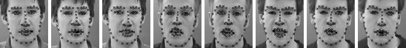

This is a **RCN model** trained on **300W** dataset with this parameters:

```
THEANO_FLAGS=floatX=float32,device=gpu,force_device=True python create_procs.py --L2_coef=1e-10 --L2_coef_ful=1e-08 
--file_suffix=RCN --num_epochs=4000 --zero_non_pooled --learn_upsampling --paral_conv=5.0 --use_lcn --block_img
--rotation=20
```

**Note**: To use this model on 300W dataset, make sure you have done steps 1 and 2.2 mentioned [here](https://github.com/SinaHonari/RCN/blob/master/README.md).

------------------------------------

# Using RCN model on random face images

In order to use a trained RCN model to predict keypoints on random face images do the followings:

### 1 - Clone the repo

### 2 - Pre-process the images

   2.1 - Detect faces such that the degree of zoomness of the faces are similar to the ones shown below (If the 
         images are too much zoomed out or zoomed in, it might not work as well, unless the model is trained accordingly).
  
<p align="center">

</p>
       
   2.2 - Resize the images to 80*80
   
   2.3 - Make images gray-scale. You can do the following to make images gray-scale:
   
   ```
   from RCN.preprocessing.tools import BGR2Gray
   set_x = BGR2Gray(set_x)
   ```

### 3- Write a module to get key-point locations 
You can look at method get_kpts [here](https://github.com/SinaHonari/RCN/blob/master/plotting/draw_points_guide.py) as a proxy on how to do this.   
(Note that this method may not work by default and it is written there simply as a guideline):

   3.1 - Create an object of the RCN model:
   
   ```
   tcdcn, params = create_TCDCN_obejct(param_pathe)
   tcdcn.load_params(param_path)
   ```

   param_path is the path to the pickle file of the trained RCN model.

   3.2 - Call the method that predicts the key-points (in a loop over mini-batches):
   
    
   ```
   kpt_prediction = tcdcn.get_keypoints_MTFL(x_batch, bound_mask, border_pixel, dropout=0)
   ```

    - x_batch is a batch of shape (#batch, #row=80, #cols=80, #channels=1)
      where #channels should be 1 since the images are gray-scale.
    
    - bound_mask is a matrix of zeros of shape (#batch, #kpts=68).
    
    - border_pixel is a matrix of shape (#batch, 4) composed as
      [[0, 0, 79, 79],
       [0, 0, 79, 79],
       ...
       [0, 0, 79, 79]]

`kpt_prediction` is a matrix of shape (#batch, #kpts * 2).  
It should be reshaped to (#batch, #kpts, 2) to give x and y (in the last axis) for each key-point.

You can plot the predicted key-points as shown here:
<p align="center">

</p>
